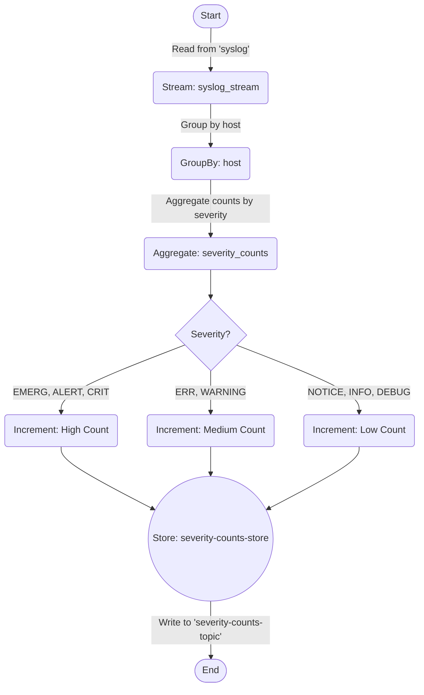

# Syslog Severity Count Aggregator

## Intro

This is a toy example for how to create a streaming app that uses a KTable with defined schemas for the input and output topics. This project showcases how the app can be created both with Java, as well as how to create a similar processor using KSQL.

## Problem Statement

In many IT environments, syslogs are a critical component for monitoring and analyzing the health of systems and applications. They provide a wealth of information about system performance, security threats, and operational issues. However, syslogs can be voluminous and complex to analyze in real-time. The goal of this project is to streamline the analysis of syslog messages by aggregating them based on their severity levels, making it easier for IT administrators to monitor and respond to system alerts efficiently.

## Objective

The primary objective of this application is to read syslog messages from a Kafka topic, aggregate them by their severity level (e.g., `EMERG`, `ALERT`, `CRIT` as high; `ERR`, `WARNING` as medium; `NOTICE`, `INFO`, `DEBUG` as low), and produce a continuous count of these categories per host. This aggregation aims to provide a summarized view of the system's health and alert status, enabling quicker diagnostics and decision-making.

## Model

- **Input**: Syslog messages, each containing a `host` identifier and a `severity` level.
- **Processing**: Messages are grouped by `host`, and counts are aggregated by severity level.
- **Output**: A stream of counts for each severity level, continuously updated as new messages arrive.

## Topics

- **Input Topic (`syslog`)**: Contains incoming syslog messages. Each message has a `host` and a `severity` attribute.
- **Output Topic (`severity-counts-topic`)**: Stores the aggregated count of syslog messages by their severity level for each host.

## Components Used

- **Apache Kafka**: Serves as the backbone for message queuing and distribution.
- **Kafka Streams**: Utilized for the Java-based stream processing application, providing the capability to process messages in real-time.
- **ksqlDB**: Offers an alternative approach to stream processing using SQL-like queries, allowing for easier development and maintenance.
- **Schema Registry**: Ensures that message schemas are consistently enforced, facilitating the serialization and deserialization of Avro messages.

## Deployment

Both the Kafka Streams and ksqlDB versions of the application are containerized for ease of deployment. The project includes a `docker-compose.yml` file to orchestrate the deployment of Kafka, ZooKeeper, Schema Registry, ksqlDB Server, and the respective applications.

## Usage

Running `start.sh` will bring up the docker-compose services. These services bring up the basic Confluent Kafka infrastructure, the Severity streams app, a test Syslog producer, and the KSQL required to mimic the streams app.

```bash
./start.sh
```

You can also use the python script to generate some test data to see the streams app in action.

Note: this python script requires dependency packages to be installed prior to running:

```bash
pip3 install -r requirements.txt
```

```bash
python3 syslog_producer.py
```

This script allows you to alter the number of messages generated, the frequency of messages, and the severity levels of the messages. a bit easier than it would be on the Java side.

## Monitoring and Management

Both versions of the application can be monitored via Confluent Control Center or using Kafka's native monitoring tools. Details on setting up monitoring are included in the deployment instructions.

This setup can be extended to be monitored in Grafana/Kibana based off of user requirements.

## Diagram of Topology

This diagram shows the streams topology used for both the streams app and the KSQL. The only difference is the KSQL will use topics that are suffixed with `_ksql`.


